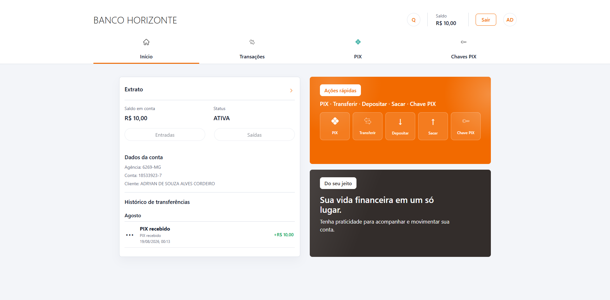
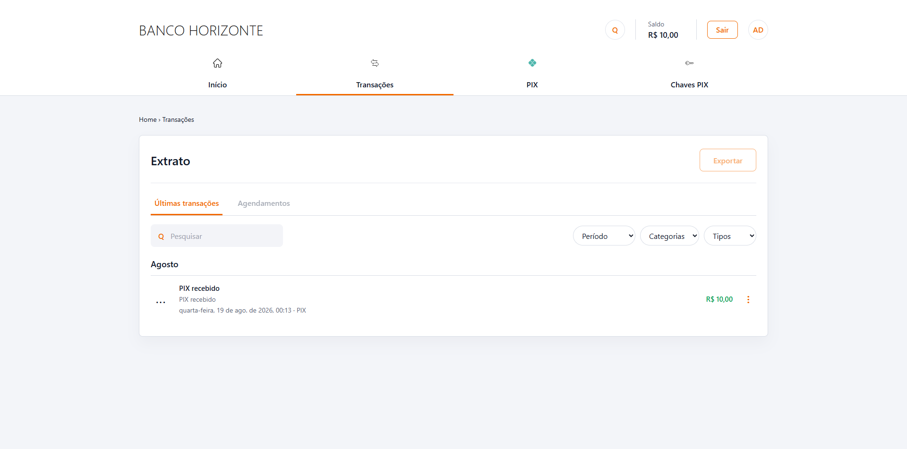

# Banco Horizonte — Sistema Bancário

Aplicação bancária desenvolvida com foco no backend, utilizando Java e Spring Boot para disponibilizar uma API REST responsável pelo cadastro de clientes, gerenciamento de contas e operações financeiras. O projeto também possui uma interface React para consumo e demonstração das funcionalidades da API.

## Visão geral


### Principais funcionalidades

- Cadastro e login de clientes PF e PJ
- Criação automática de conta bancária
- Consulta e atualização de dados cadastrais
- Depósito e saque com validação de saldo
- Transferências PIX com confirmação por senha
- Cadastro e consulta de chaves PIX
- Extrato com busca e filtros
- Dashboard com saldo, histórico e ações rápidas





## Tecnologias

| Backend | Frontend | Banco e ferramentas |
|---|---|---|
| Java 21 | React 19 | MySQL |
| Spring Boot | TypeScript | Flyway |
| Spring Web | Vite | Maven |
| JDBC | CSS responsivo | BCrypt |

## Arquitetura

```text
Frontend React → API REST → Controller → Service → Repository → MySQL
```

O backend utiliza arquitetura em camadas, persistência com JDBC manual, migrations Flyway e transações com `commit` e `rollback`. Senhas são armazenadas com BCrypt e não são retornadas pela API.

## Como executar

### Pré-requisitos

- Java 21
- Node.js e npm
- MySQL

Crie um arquivo `.env` na raiz:

```env
DB_URL=jdbc:mysql://localhost:3306/seu_banco
DB_USER=seu_usuario
DB_PASSWORD=sua_senha
```

Inicie o backend:

```bash
./mvnw spring-boot:run
```

No Windows:

```powershell
.\mvnw.cmd spring-boot:run
```

Em outro terminal, inicie o frontend:

```bash
cd frontend
npm install
npm run dev
```

Acesse `http://localhost:5173`. A API será executada em `http://localhost:8080`.

## Endpoints principais

| Método | Endpoint | Descrição |
|---|---|---|
| `POST` | `/clientes/cadastro/pf` | Cadastrar pessoa física |
| `POST` | `/clientes/cadastro/pj` | Cadastrar pessoa jurídica |
| `POST` | `/login/pf` | Autenticar cliente |
| `GET` | `/clientes/{id}` | Consultar cliente |
| `PATCH` | `/clientes/pf/{id}` | Atualizar pessoa física |
| `PATCH` | `/clientes/pj/{id}` | Atualizar pessoa jurídica |
| `POST` | `/conta/deposito/{clienteId}` | Realizar depósito |
| `POST` | `/conta/saque/{clienteId}` | Realizar saque |
| `GET` | `/conta/{contaId}/transacoes` | Consultar extrato |
| `POST` | `/pix` | Realizar transferência PIX |
| `POST` | `/cadastroChave` | Cadastrar chave PIX |
| `GET` | `/cadastroChave/{contaId}` | Listar chaves PIX |

## Autor

Desenvolvido por **Adryan Souza** como projeto de estudo e portfólio full stack.
